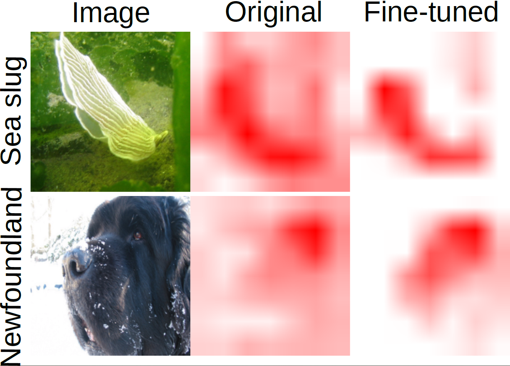
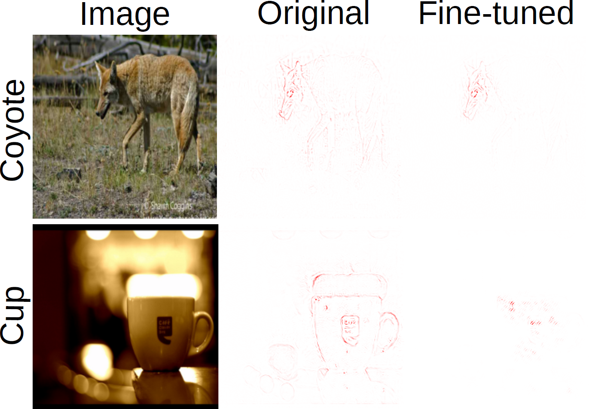
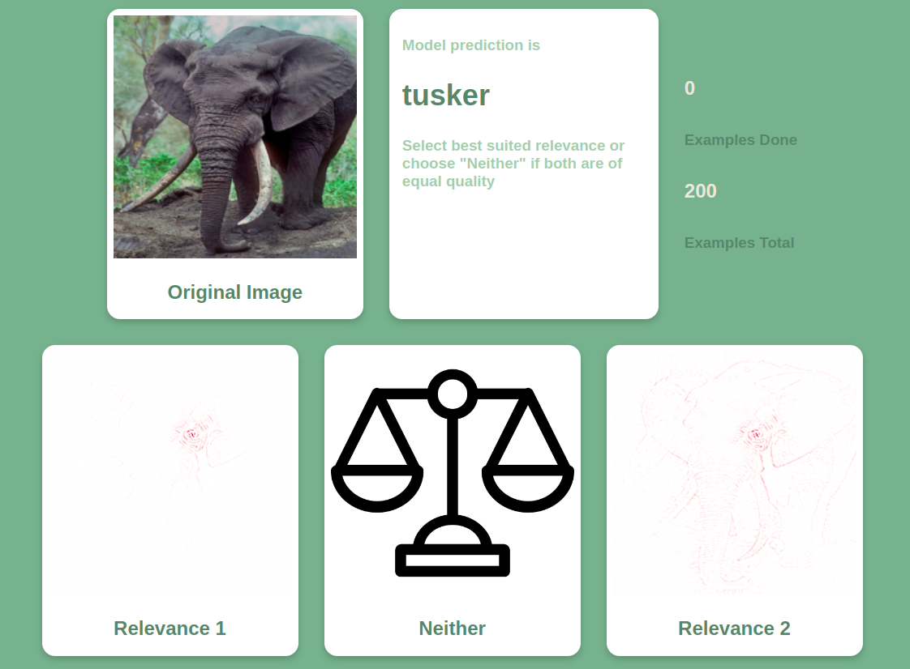

 
<h1>Evaluating Harmony: Neural Network Explanation Metrics and Human Perception</h1>

This repository contains the source code for a new method of evaluating the alignment between human perception and evaluation metrics for attribution-based methods.

## Model fine-tuning and data preparation

The first step of evaluating an evaluation metric is to fine-tune a model on the metric.
You can define your backprop-enabled metric by extending the `metric.LearnableMetric` class and supplying the appropriate trainer located in the `trainer` module, or writing your own by extending the `trainer.LearnableMetricTrainer` class.
After fine-tuning, supply your model to the `create_harmony_dataset` method in the `harmony_dataset` module to automatically create a dataset which can be used within the supplied web aplication in this repository.

GradCAM RMA Fine-tuned             |  Guided-GradCAM RMA Fine-tuned
:-------------------------:|:-------------------------:
  |  
*Figure 1. GradCAM attributions from localization experiments. The first row corresponds to the Focus experiment, while the second row pertains to the RMA experiment. Optimizing localization metrics improves the quality of the attribution maps.* | *Figure 2. GuidedBackprop attributions from localization experiments. The first row corresponds to the Focus experiment, while the second row pertains to the RMA experiment. Optimizing localization metrics further sparsifies the resulting attributions, rendering them less interpretable.*

## HARMONY web application

Once you create the dataset, you can load it into the web application using [Django fixtures](https://docs.djangoproject.com/en/5.0/topics/db/fixtures/). Then, simply run the application, add the annotators to the user database and label the previously created examples. The labels are saved to a database, which can subsequently be analyzed to report the alignment of an evaluation metric to the human perception.

*Figure 3. An example from our user study. The original image and the model's prediction is presented in the first row. In the following row, we visualize the original model's attribution map for the target class, the fine-tuned model's map, and the option "Neither".*
